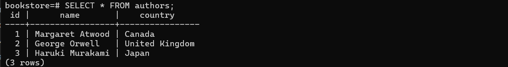
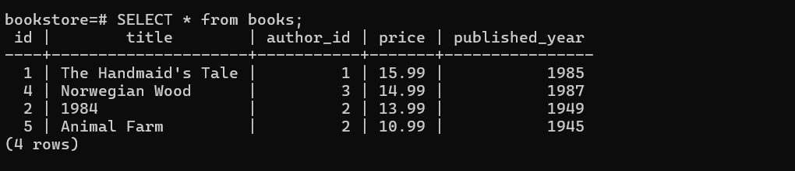
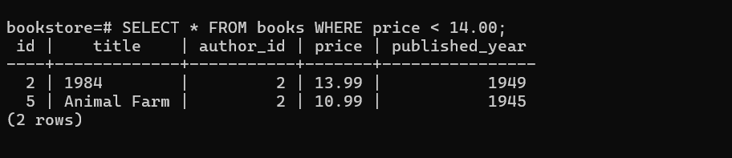
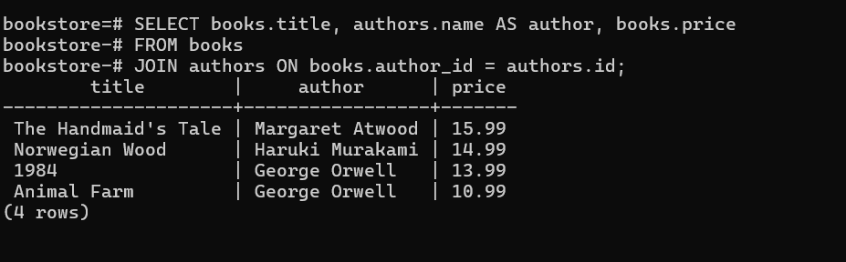
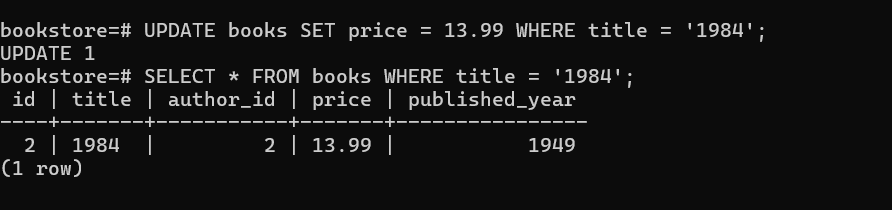
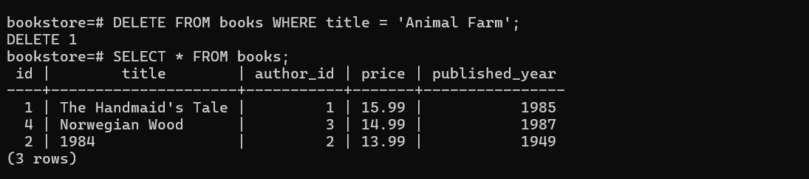
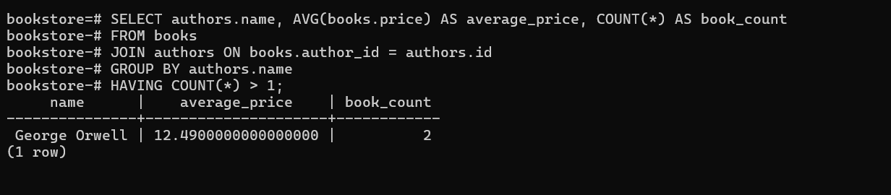

**Todo 1:** Create a new database called `bookstore`.

**Todo 2:** Create two tables for authors and books.

***Evidence of Todo 1 and 2***

**Todo 3:** Insert authors data into the `authors` table:

**Todo 4:** Insert books data into the `books` table:

**Todo 5:** Write a query to select all books that cost less than $14.00.

**Todo 6:** Write a query to display all books along with their author's name using a JOIN. The result should show the book title, author name, and price.

**Todo 7:** The price of "1984" has increased. Update it to $13.99.

**Todo 8:** Delete the book "Animal Farm" from the database.

**Bonus Challenge:** Write a query to find the average price of all books by each author, showing only authors with more than one book.

